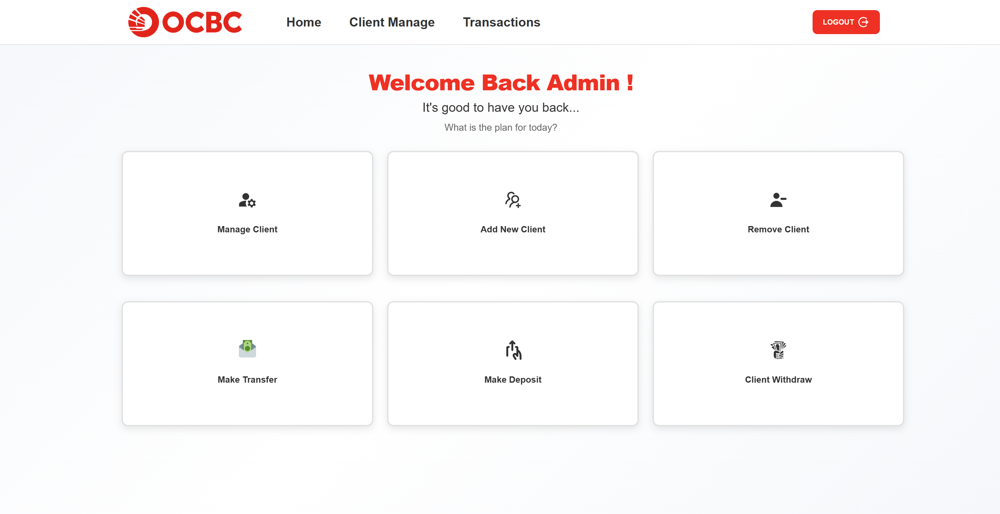
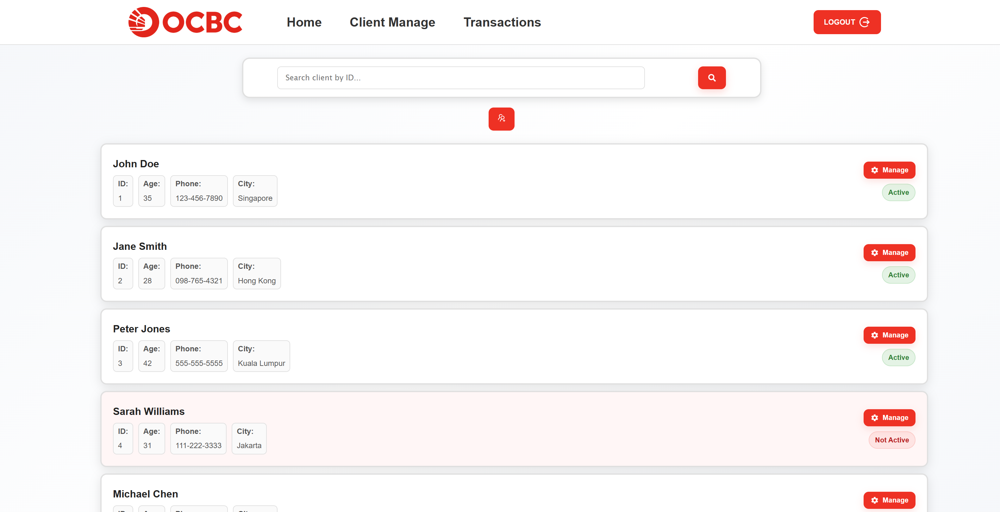
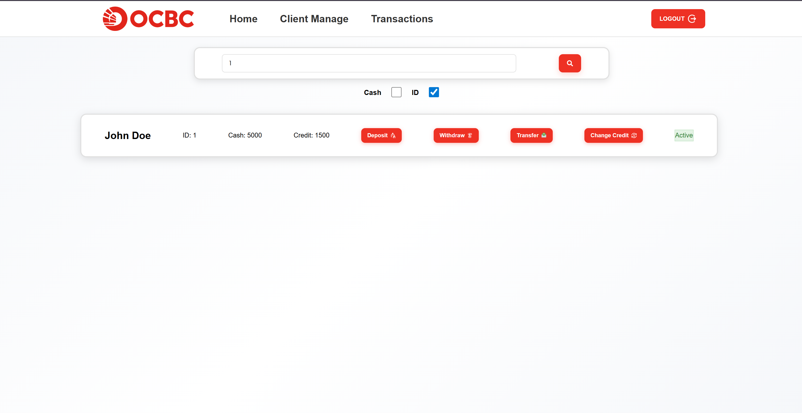
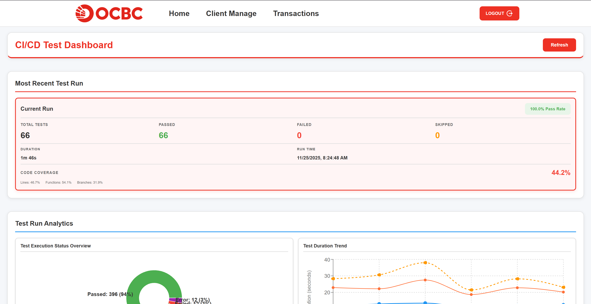
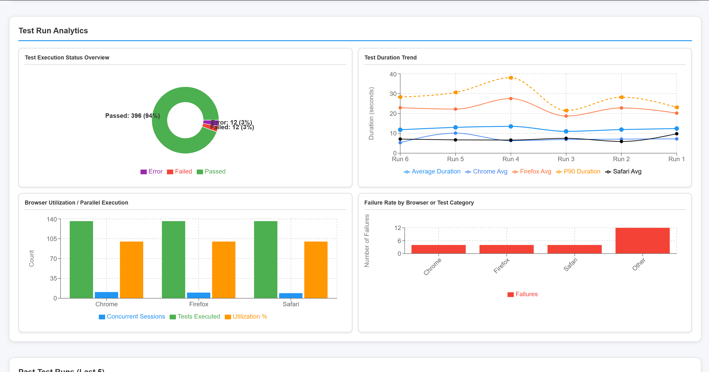
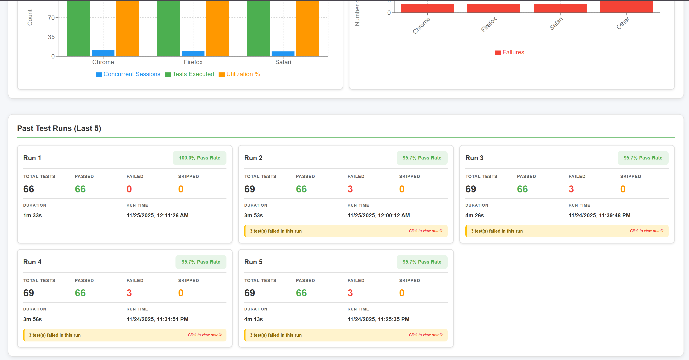
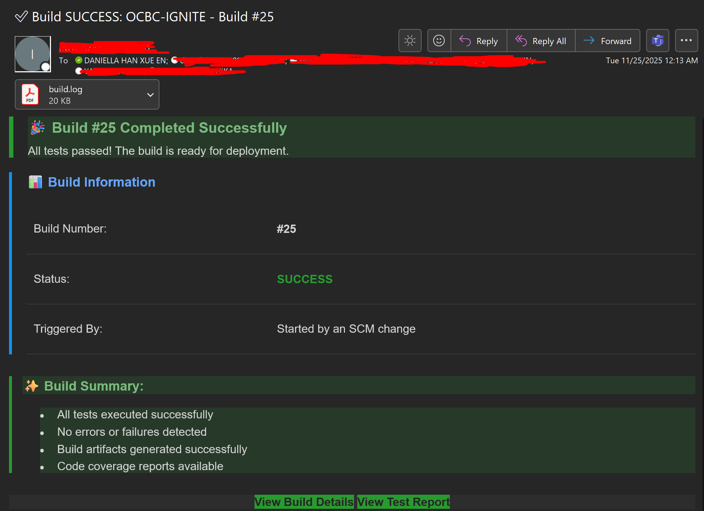
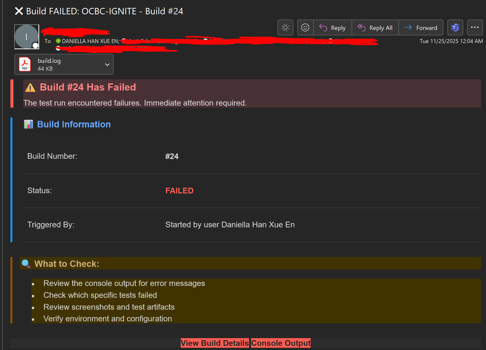

# Bank Manager Application

**Forked from [DanielYehezkely/bank-management-react](https://github.com/DanielYehezkely/bank-management-react) for the OCBC Ignite Challenge.**


## Problem Statement

**Enable cross platform browsers automation**

With the growing number of applications in the bank, the test cases will increase. How do we develop a scalable and user-friendly platform to run these test cases automatically without users’ manual intervention?

## Changes Made for OCBC Ignite Challenge

To address the problem statement and enhance the application for the hackathon, the following changes were implemented:

- **UI/UX Improvements**: Overhauled the user interface to align with OCBC's corporate design identity, creating a more professional, readable, and intuitive experience for bank administrators.
- **Backend Transformation**: Migrated the data persistence layer from Firebase to a local JSON file structure. This ensures data validity and stability for the prototype demonstration, removing external dependencies for the hackathon context.

## Login Credentials

Please use the following credentials to access the application:

| Username | Password |
| -------- | ----------- |
| eladtester@test.test | elad12345678 |

## Table of Contents

1. [Overview](#overview)
2. [Features](#features)
3. [Tech Stack](#tech-stack)
4. [Setup and Installation](#setup-and-installation)
5. [Testing](#testing)
6. [CI/CD Pipeline](#cicd-pipeline)
7. [Environment Variables](#environment-variables)
8. [Screenshots](#screenshots)

## Overview

The Bank Manager Application is a web-based platform designed for bank administrators to efficiently manage clients and handle banking transactions. It provides a streamlined interface for operations such as client onboarding, fund transfers, and credit management.

## Features

- **Admin Authentication**: Secure login system for authorized access.
- **Client Management**: Comprehensive tools to add, edit, and remove client records.
- **Transaction Processing**:
    - Withdrawals and Deposits
    - Fund Transfers between accounts
    - Credit Limit adjustments
- **Real-time Feedback**: Instant form validation and user notifications for all actions.

## Tech Stack

- **Frontend**: React, JSX, CSS (Vanilla)
- **State Management**: React Context API
- **Testing**: Playwright, Istanbul (nyc)
- **CI/CD**: Jenkins

## Setup and Installation

1. **Clone the repository**:
   ```bash
   git clone https://github.com/Troaxx/ocbc-ignite-challenge.git
   cd ocbc-ignite-challenge
   ```

2. **Install dependencies**:
   ```bash
   npm install
   ```

3. **Configure Environment**:
   Create a `.env` file in the root directory and add the required variables (see [Environment Variables](#environment-variables)).

4. **Start the application**:
   ```bash
   npm start
   ```
   The app will run at `http://localhost:3000`.

## Testing

A key focus of this project is robust, automated cross-browser testing.

### Methodology
- **Playwright**: Utilized for End-to-End (E2E) testing. It allows us to automate interactions across Chromium, Firefox, and WebKit engines, ensuring the application works consistently for all users.
- **Istanbul (nyc)**: Integrated to track code coverage. This ensures that our tests are not just running, but actually exercising the critical logic of the application.

### Test Suite

| Test File | Description |
| --------- | ----------- |
| `authentication.spec.js` | Verifies login functionality, including valid/invalid credential handling. |
| `client-management.spec.js` | Tests the complete client lifecycle: Create, Read, Update, Delete (CRUD). |
| `transactions.spec.js` | Validates core banking operations: Deposits, Withdrawals, and Credit updates. |
| `transfers.spec.js` | Ensures accuracy and integrity of fund transfers between accounts. |
| `demo-failure.spec.js` | **Demo Only**: Intentionally fails to demonstrate the CI/CD pipeline's error reporting capabilities. |

### Running Tests

```bash
# Run the full test suite (headless)
npm test

# Run tests with interactive UI
npm run test:ui

# View coverage report
npm run coverage:report
```

## CI/CD Pipeline

This project features a fully automated CI/CD pipeline powered by **Jenkins**.

1. **Trigger**: Pushes to the `main` branch automatically trigger a new build job.
2. **Test Execution**: Jenkins checks out the code, installs dependencies, and runs the Playwright test suite.
3. **Reporting**:
    - **Success**: If all tests pass, a success email is sent.
    - **Failure**: If any test fails (e.g., `demo-failure.spec.js`), a failure notification is sent immediately.
4. **Dashboard**: A centralized dashboard visualizes build status and test results.

## Environment Variables

Create a `.env` file with the following configuration:

```env
VITE_ADMIN_EMAIL="eladtester@test.test"
VITE_ADMIN_PASSWORD="elad12345678"

VITE_JENKINS_URL=http://localhost:8080
VITE_JENKINS_JOB_NAME=OCBC-IGNITE
VITE_JENKINS_BUILD_NUMBER=lastCompletedBuild
```

### Screenshots

## Admin Home Page/Dashboard
Admins can access all actions via the home page.


## Client Management
Search clients by ID to manage their profile.


### Transaction Interface
Search clients by ID to perform transaction actions.


## CI/CD Dashboard
Configured graphs are:
- Test Execution Status Overview
- Test Duration Trend
- Browser Utilization / Parallel Execution
- Failure Rate by Browser or Test Category

  

### Additional Features

## Email Notifications
These notifications were configured via Jenkins. It sends a email to the recepient list whenever a build succeeds or fails.

### Success Email



### Failure Email


